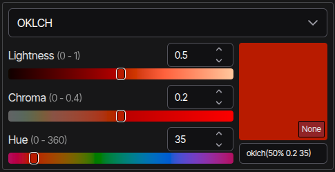

# vue-colorjs-picker



A Vue 3 color picker component built on [colorjs.io](https://colorjs.io/).

## Installation

```bash
npm install vue-colorjs-picker
```

## Usage

```vue
<script setup>
import { ref } from 'vue'
import { ColorPicker } from 'vue-colorjs-picker'

import 'vue-colorjs-picker/style.css'

const color = ref('oklch(0.7 0.2 180)')
</script>

<template>
  <ColorPicker v-model="color" />
</template>
```

## Components

- `ColorPicker` - Main color picker component with space selector and channel sliders
- `ColorChannelSlider` - Individual channel slider (can be used standalone)
- `ColorSwatch` - Color display with gamut indicator

## Customization

The components support slots for customizing the UI:

```vue
<ColorPicker v-model="color">
  <template #select="{ value, options, onUpdate }">
    <!-- Custom select component -->
  </template>
  <template #text-input="{ value, onUpdate }">
    <!-- Custom text input -->
  </template>
  <template #slider-input="{ value, min, max, step, onUpdate }">
    <!-- Custom number input for sliders -->
  </template>
</ColorPicker>
```

## License

MIT
